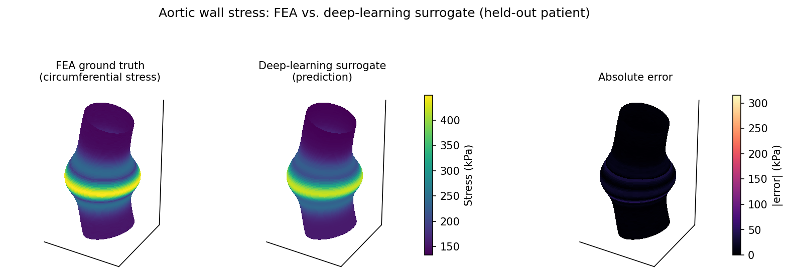
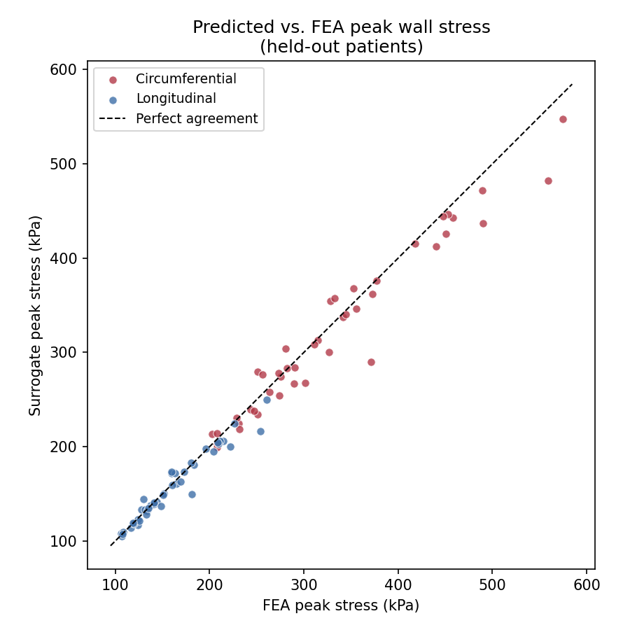

# Deep-Learning Surrogate for Aortic Wall-Stress Analysis

A fast machine-learning surrogate that predicts **wall-stress distributions on
ascending thoracic aortic aneurysms (aTAAs)** directly from vessel geometry,
as a near-instant replacement for finite-element analysis (FEA). It reproduces
the methodology of my first-author abstract,
[*Clinical Application of Deep Learning for Stress Analysis of Ascending
Thoracic Aortic Aneurysms*](https://www.ahajournals.org/doi/abs/10.1161/circ.142.suppl_3.16111)
(Rahaman et al., *Circulation* 2020).

> **Why this matters clinically:** guidelines decide elective aTAA surgery
> mainly on aneurysm *diameter*, but biomechanically a dissection occurs when
> wall *stress* exceeds wall strength. FEA can compute that stress from a
> patient's CT-derived geometry, but it is slow and labor-intensive. A surrogate
> that returns the same stress field in milliseconds makes stress-based risk
> assessment usable in the clinic.

> **First-author note + data:** I was first author on the abstract this
> reproduces. The original study ran on 169 patient-specific geometries from
> ECG-gated CT, with FEA ground truth from LS-DYNA and the surrogate implemented
> in Julia. That clinical data is private, so this repo **regenerates the
> methodology on synthetic aTAA geometries** whose ground-truth stress comes
> from a transparent biomechanical model (Laplace's law plus a curvature-driven
> stress concentration at the bulge). It is a faithful re-implementation of the
> *approach* in Python — not the original clinical results, which are reported
> below for reference.

## The idea in one picture

For a held-out synthetic patient, the surrogate's predicted circumferential
stress field is visually indistinguishable from FEA, with error confined to the
high-stress aneurysm apex:



## Method

This follows the abstract's design: an **unsupervised** dimensionality-reduction
stage feeding a **supervised** regressor.

```
Aorta geometry            Unsupervised            Supervised           Stress field
(node coordinates)  ──►   shape PCA  ──►  shape  ──►  neural net  ──►  stress  ──►  inverse  ──►  per-node
                                          codes       (MLP)            codes       stress PCA     stress
```

1. **Statistical shape model (PCA)** — each aorta is a fixed-topology surface
   mesh; PCA on the node coordinates compresses the shape to ~20 modes.
2. **Stress-field PCA** — the FEA stress fields are likewise compressed to ~20
   modes (the stress distribution across patients is low-rank).
3. **Neural-network regression** — a multilayer perceptron maps shape codes →
   stress codes; the prediction is inverse-transformed through the stress PCA
   basis to recover the full per-node field.
4. **Evaluation** — 10-fold cross-validation, reporting mean absolute error
   (MAE) over all nodes and absolute peak-stress error (APE) per patient,
   separately for the circumferential and longitudinal directions, exactly as
   the abstract does. PCA bases and the network are fit on each fold's training
   split only (no leakage).

## Results

The synthetic demonstration lands in the same regime as the original clinical
study — average stresses matched by construction (the biomechanical model is
calibrated to them), and a cross-validated MAE that is a small fraction (~3–4%)
of the stress magnitude, the abstract's core "fast **and** accurate" claim:

| Metric | This repo (synthetic, 10-fold CV) | Original abstract (clinical) |
|---|---|---|
| Mean circumferential stress | 174 kPa | 175.64 ± 4.17 kPa |
| Mean longitudinal stress | 92 kPa | 95.69 ± 2.15 kPa |
| **MAE, circumferential** | **6.3 ± 1.0 kPa** | 5.06 ± 1.08 kPa |
| **MAE, longitudinal** | **2.6 ± 0.4 kPa** | 4.51 ± 0.98 kPa |
| APE (peak), circumferential | 14.3 ± 4.3 kPa | 2.58 ± 1.39 kPa |
| APE (peak), longitudinal | 5.5 ± 1.3 kPa | 2.32 ± 1.84 kPa |

Peak-stress error (APE) is higher here than in the original — the PCA basis
slightly smooths the localized stress concentration at the aneurysm apex, so the
surrogate marginally under-predicts the most extreme peaks. That tendency is
visible in the parity plot, where agreement is tight through the mid-range and
falls just below the line at the highest stresses:



## Repo structure

```
.
├── src/
│   ├── geometry.py        # synthetic patient-specific aTAA geometries (θ,s mesh)
│   ├── biomechanics.py    # FEA-like ground-truth stress (Laplace + curvature)
│   ├── generate_dataset.py# builds the 169-patient cohort -> .npz
│   ├── surrogate.py       # shape PCA + MLP + stress PCA; 10-fold CV; MAE/APE
│   └── visualize.py       # 3D stress-field comparison + peak-stress parity
├── results/               # generated metrics (JSON/CSV)
├── figures/               # generated figures
├── run_all.py             # runs the whole pipeline
└── requirements.txt
```

## How to run

```bash
pip install -r requirements.txt
python run_all.py
```

Everything is seeded and reproducible; the full pipeline (data → 10-fold CV →
figures) runs in about a minute on a CPU, no GPU required.

## Notes on faithfulness

- **What's reproduced:** the surrogate architecture (PCA shape model + neural-
  network regression to a PCA stress basis), the evaluation protocol (10-fold
  CV, MAE and peak-stress APE per direction), and the biomechanically-correct
  relationship that hoop stress is ~2× longitudinal (Laplace's law), which is
  why the abstract's two directional means differ as they do.
- **What's different:** the original used real CT geometries, FEA ground truth
  from LS-DYNA, and a Julia implementation; this uses synthetic geometries,
  a closed-form biomechanical ground truth, and Python/scikit-learn. The numbers
  here are from the synthetic demonstration, with the clinical results shown
  only for reference.

## Tech stack

Python · NumPy · scikit-learn (PCA, MLPRegressor) · matplotlib (3D)

**Domain:** cardiovascular biomechanics · finite-element analysis surrogate ·
statistical shape modeling · aortic aneurysm risk
